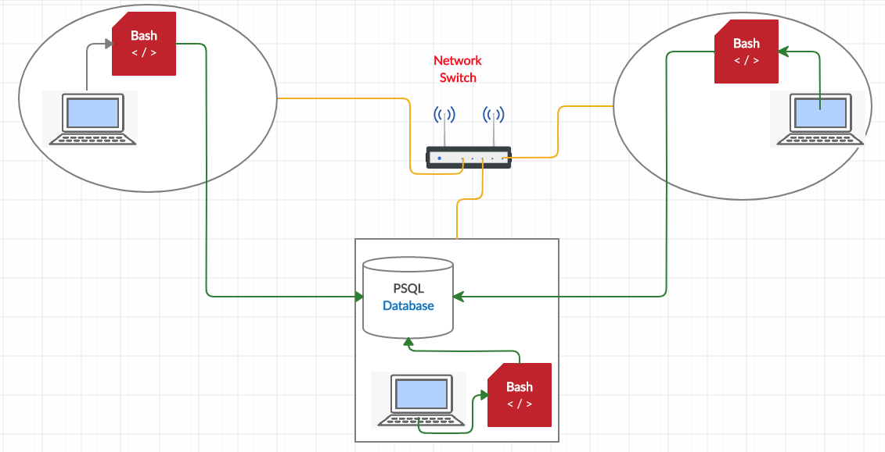

## Introduction
- A **Linux Cluster**: is a connected array of Linux computers or nodes that work together and can be viewed and managed as a single system. Nodes are usually connected by fast LANs, with each node running its own instance of Linux. Nodes may be physical or virtual machines, and they may be separated geographically. Each node includes storage capacity, processing power and I/O bandwidth. Multiple redundant nodes of Linux servers may be connected as a cluster for high availability (HA) and Fault tolerance where each node is capable of failure detection and recovery.
[Linux Cluster Definition](https://susedefines.suse.com/definition/linux-cluster/)
- A **Cluster Monitoring Agent**: is an intelligent real-time application that observes the system resources and gathers data from each node of the cluster about hardware specifications and usage perfomance such as CPU utilization, Networking traffic, etc. The collected metrics are stored in a PostgreSQL database hosted locally on a designated node. It performs data analytics using the persisted data to assist in servers load balancing, failure detection and fast recovery, resource management and forecasting.

## Architecture and Design
- An elected **PSQL node** with a central **PSQL** database, running in a **Docker** container, recieves metrics collected from all nodes and stores **hardware specifications** in table `host_info` and **server usage** data in table `host_usage`.
- Each host runs two scripts: `host_info.sh` and `host_usage.sh` to collect metrics about this node, then persists it in the PSQL database.
- The `host_info` script is executed once upon initialization, assuming that hardware specifications are static.
- The `host_usage` script is scheduled by a Linux **crontab** job to be executed every minute.
- The PSQL node executes a bash script `psql_docker.sh` that creates, starts or stops the PostgreSQL server container.
- Another bash script `ddl.sql` on the PSQL node defines the database schema, and creates PostgreSQL database along with host_info and host_usage tables.
- **host_info** table is defined with data columns: 
*id, hostname, cpu_number, cpu_architecture, cpu_model, cpu_mhz, L2_cache* timestamp*.
- **host_usage** table is defined with data columns:
*timestamp, id, memory_free, cpu_idle, cpu_kernel, disk_io, disk_available*- 
## Usage

| BASH FILE | COMMANDs |
| --------- | ------- |
| `psql_docker.sh` | psql_docker.sh start |
|                  | psql_docker.sh stop |
|                  | psql_docker.sh create [DB_USERNAME][DB_PASSWORD]
| `ddl.sql` | psql -h [HOSTNAME] -U [HOST_AGENT] -d  [DB_NAME] -f ddl.sql |
| `queries.sql` | psql -h [HOSTNAME] -p [port number] -U [username] -c "queries.sql" |
| `host_info.sh` | host_info.sh [PSQL_HOST] [PSQL_PORT] [DB_NAME] [PSQL_USER ] [PSQL_PASSWORD] |
| `host_usage.sh` | host_usage.sh  [PSQL_HOST] [PSQL_PORT] [DB_NAME] [PSQL_USER ] [PSQL_PASSWORD]|

## Improvements
1. Add and collect more fields to the tables in the database.
2. Create more queries.
3. Clean up old data script.
